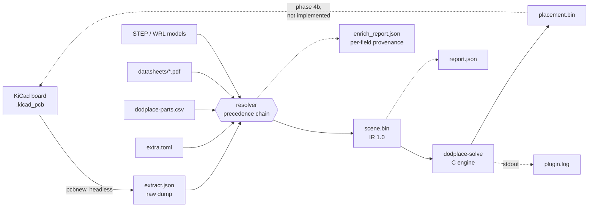
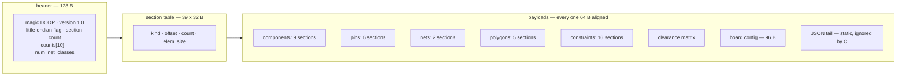
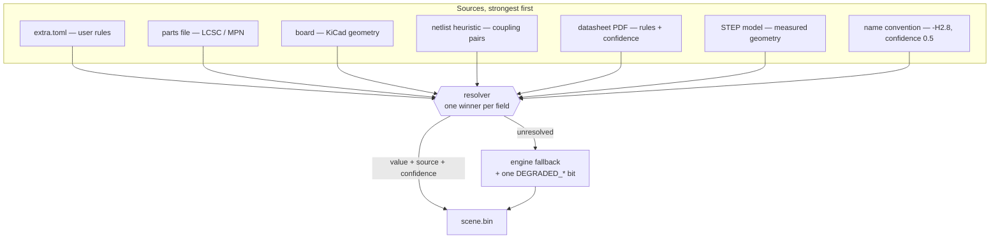
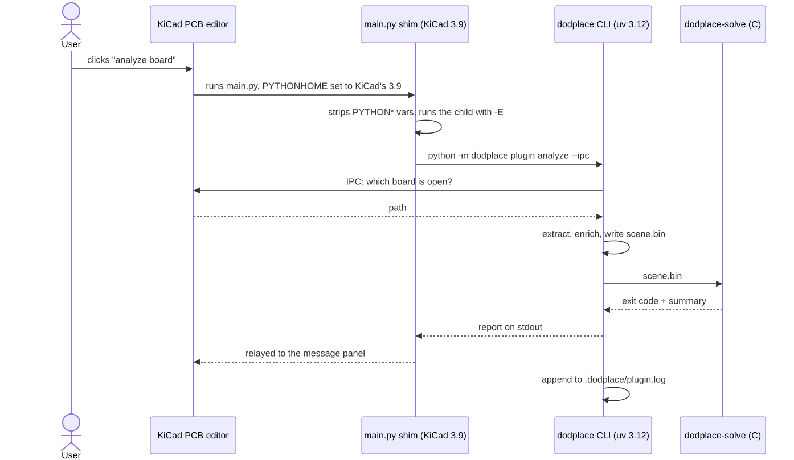
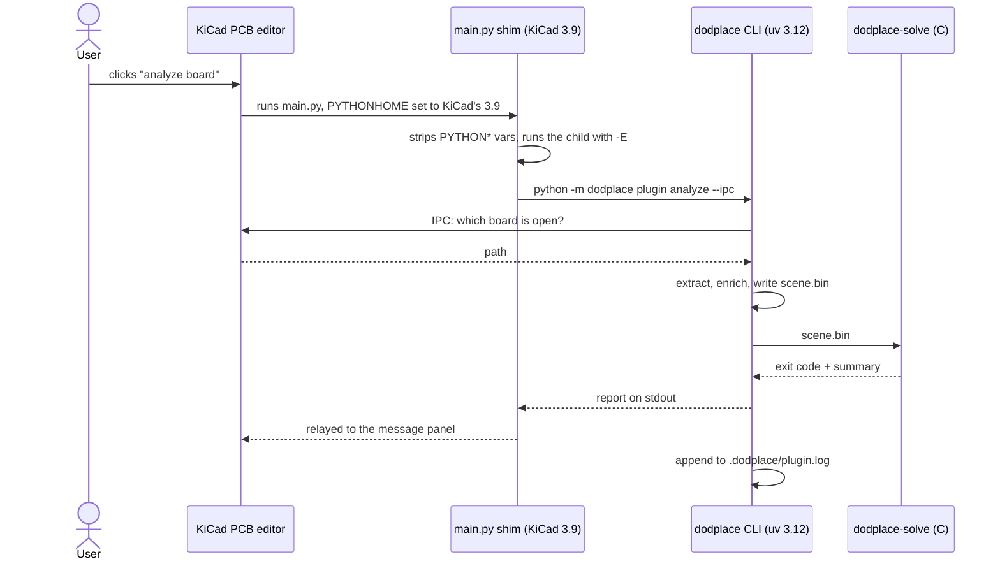

# dodplace — data map

Every byte the project writes: which file it lands in, who writes it, who reads
it, and what is deliberately left out.

Companion to [`../ir/spec.md`](../ir/spec.md), which is the normative format
specification for the two binary files.

> The diagrams below render inline in GitLab, GitHub, VS Code and CLion. Each
> one is also shipped as an SVG in `diagrams/`, so a plain viewer shows the
> picture too. The SVGs are renders of the Mermaid sources; regenerate them
> locally with
> `npx -y @mermaid-js/mermaid-cli -i <file>.mmd -o <file>.svg`.

---

## 1. Pipeline overview



<details>
<summary>Mermaid source</summary>



</details>

Solid arrows are implemented; the dotted arrow back into KiCad is the only
missing step (applying a placement).

---

## 2. Who writes what

| File | Written by | Read by | Real size on a 707-part board |
|---|---|---|---|
| `scene.bin` | Python: `ingest`, plugin action | **the C engine** | 144 KB |
| `placement.bin` | **C**: `dodplace-solve` | Python: plugin, tests | *(not produced yet)* |
| `extract.json` | Python: `extract`, plugin action | the resolver, humans | 1.2 MB |
| `enrich_report.json` | Python: resolver | humans, tooling | 193 KB |
| `report.json` | Python: plugin action | humans, CI | 1.4 KB |
| `plugin.log` | Python: plugin action | humans, `plugin log -f` | 7 KB |
| `extra.toml` | **you** (`enrich extra` seeds it) | the resolver | 3.6 KB |
| `dodplace-parts.csv` | **you** (`enrich skeleton` seeds it) | `enrich parts` | 1.3 KB |
| `cache/**/*.json` | `enrich parts`, resolver | the resolver | — |
| plugin files | `plugin install` | KiCad | 8 files |

All run artifacts land in `<board directory>/.dodplace/`. Nothing else is
written, anywhere, except the plugin directory and the repo pointer file.

---

## 3. `scene.bin` — the engine input



<details>
<summary>Mermaid source</summary>



</details>

### Components — 9 payload sections, `num_comps` elements each

| Section | Type | Field | Origin | Fallback |
|---|---|---|---|---|
| 1, 2 | f32 | `x`, `y` — courtyard centre, mm | footprint position | raw coordinates |
| 3, 4 | f32 | `half_w`, `half_h` — courtyard AABB | explicit AABB, or polygon AABB | pad bbox + margin |
| 5 | f32 | `height` — z extent, mm | STEP → PDF → parts file → `extra.toml` → name convention | 0, pure 2D |
| 6 | f32 | `mass` — grams | parts file / PDF | 0, no inertia |
| 7 | u8 | `flags` — orientation, side, locked, rot_fixed, poly courtyard, has height, has mass | KiCad + enrichment | 0°, top, unlocked |
| 41 | u8 | `kind` — role from the reference prefix: IC, capacitor, inductor, crystal, connector, mechanical... | refdes prefix (`U`, `C`, `L`, `Y`...) | unknown |
| 8 | u16 | `pin_count` | counted during ingestion | — |
| 9 | u32 | `polygon_id` — exact courtyard | footprint courtyard graphics | `0xFFFFFFFF` |

`first_pin` is **not** stored: it is the prefix sum of `pin_count`, rebuilt by
`placer_context_finalize`.

### Pins — 6 payload sections

| Section | Type | Field | Origin |
|---|---|---|---|
| 10, 11 | f32 | `offset_x`, `offset_y` — local, unrotated, mm | pad position in the footprint frame |
| 12 | u32 | `comp_id` — owner | pin grouping |
| 13 | u32 | `net_id` — net, or `0xFFFFFFFF` | netlist |
| 14 | u8 | `flags` — power, ground, diff P/N, clock, inferred | datasheet pinout, else net name |
| 15 | f32 | `max_current` — amps, 0 unknown | datasheet / parts file |

### Nets — 2 payload sections

| Section | Type | Field | Origin | Fallback |
|---|---|---|---|---|
| 16 | f32 | `weights` | net classes | uniform 1.0 |
| 17 | u8 | `net_class` — index into the matrix | KiCad netclass assignment | class 0 |

The CSR (`net_offsets`, `net_to_pins`) is **not** stored — it is rebuilt by a
counting sort over `pins.net_id`.

### Polygons — 5 payload sections

| Section | Type | Field |
|---|---|---|
| 18, 19 | f32 | `vx`, `vy` — all vertices, concatenated |
| 20 | u32 | `poly_offsets` — CSR over vertices, `num_polys + 1` entries |
| 21 | u8 | `poly_kind` — 0 courtyard, 1 board outline, 2 keepout |
| 22 | u32 | `poly_layer_mask` — keepout copper mask, 0 = all |

Rings are closed implicitly: the last vertex joins the first.

### Constraints — 16 payload sections (sparse tables)

| Sections | Type | Fields |
|---|---|---|
| 23-27 | u32, u32, u32, f32, f32 | decoupling: `ic_comp`, `cap_comp`, `ic_pin`, `max_dist_sq`, `weight` |
| 28-31 | u32, f32, f32, f32 | thermal: `comp`, `power_w`, `exclusion_radius`, `r_theta_ja` |
| 32-35 | u32, u32, u8, f32 | symmetry: `comp_a`, `comp_b`, `axis`, `weight` |
| 36-38 | u32, u32, f32 | diff pairs: `net_p`, `net_n`, `max_skew_mm` |

Rows must arrive grouped by their primary component (ascending); the engine
builds the per-component CSR index by counting. The `first_by_comp` arrays are
**not** stored.

### Rules — 1 payload section

| Section | Type | Field |
|---|---|---|
| 39 | f32 | `class_clearance` — symmetric N x N matrix, row-major, mm |
| 41 | u8 | `kind` — see the components table above; emitted with the components, numbered 41 to keep the series stable |

### Board config — one 96-byte section

| Field | Meaning | Default |
|---|---|---|
| `grid_origin_x`, `grid_origin_y` | placement grid origin | 0, 0 |
| `grid_fine`, `grid_coarse` | fine / coarse step, mm | 0.1, 0.5 |
| `courtyard_fallback_margin` | pad-bbox margin, mm | 0.25 |
| `global_clearance`, `courtyard_clearance`, `min_track_width` | design rules, mm | 0.2 |
| `total_thickness`, `ceiling_height` | mechanics; 0 = unknown | 0 |
| `airflow_x`, `airflow_y` | airflow direction; (0,0) = isotropic | 0, 0 |
| `allowed_sides`, `copper_layers`, `has_stackup` | stackup | both, 0, 0 |
| `allow_vias_under_body` | false = vias forbidden under courtyards | 1 |
| `disable_mask` | `OPT_DISABLE_*` features killed by the user | 0 |
| `degraded_mask` | the producer's 21 `DEGRADED_*` bits | — |

### JSON tail

A fixed string, `{"generator":"dodplace","ir":"1.0"}`, ignored by the C reader.
It exists so a file is self-describing and so the ignored-section path stays
exercised.

---

## 4. `placement.bin` — the engine output

Header: 32 B (`DODR`, version, flags, count, entry size). Then one 12-byte
record per component, **in component-index order**:

| Field | Type | Meaning |
|---|---|---|
| `x`, `y` | f32 | new courtyard centre |
| `orient` | u8 | 0..3 → 0 / 90 / 180 / 270 degrees |
| `side` | u8 | 0 = top, 1 = bottom |
| `flags` | u8 | bit 0 locked, bit 1 moved, bit 2 unplaced |

---

## 4b. Inside `dodplace-solve` — the stages

The engine reads a scene and writes a placement; it never mutates the scene.
Every stage allocates from the scratch arena, and a stage that fails sets `ok`
to false so the entry point unwinds cleanly. `--no-cluster`, `--no-global`,
`--no-refine`, `--no-legalize` disable one stage each, `--identity` skips the
solver entirely and echoes the input.

| Stage | File | What it does |
|---|---|---|
| 1 clustering | `solver_cluster.c` | reads `comps.kind`: an IC plus the inductor and capacitor on its switching node become one rigid body; the largest part is the master, the others keep a frozen offset and orientation *relative* to it |
| 2 matching | `matching_plan.c` | assigns decoupling capacitors to the IC pin each one decouples: a discrete assignment, so no rectangle moves and the DRC cannot change |
| 3 incumbent | `solver_best.c` | legalises the input as it arrived and keeps that pose as the incumbent: the pose every later stage has to beat on the engine's own cost |
| 4 global | `solver_global.c`, `solver_analytic.c` | force-directed relaxation: every net pulls its pins to a star around their centroid, locked parts act as anchors, and the parts push each other apart by one of two models — a pairwise 1/d² sum, or (the default) the ePlace density field below |
| 5 refine | `solver_refine.c` | simulated annealing over swaps and rotations, then a deterministic rotation sweep; a rotation that would not fit the board is refused |
| 5a assignment | `swap_assign.c`, `assign_hungarian.c` | every bucket of interchangeable parts is permuted as a whole: the star model gives a cost per pairing, the Hungarian method solves the bijection exactly |
| 5b windows | `swap_window.c` | then every pair and every short run is permuted exactly on the *true* wirelength: k parts have k! orderings, small enough to enumerate and too many for a random walk to find |
| 6 legalise | `solver_legal.c` | minimum-translation-vector push out of overlaps and keepouts, then spiral relocation for whatever still collides, clamped to the board |

Stage 3 is what stops a redraw of a board that did not need one, and stage 4
holds to the same rule: a relaxation that cannot beat the pose it started from
is rolled back before the discrete stages see it. Measured on r10, the
force-directed pass turned 31.7 m of wirelength into 41.5 m unclamped, lost the
comparison, and the annealer then improved the designer's own placement to
29.8 m — which is the point: the rule is "keep the better score", not "keep the
input" and not "keep the pipeline".

Cost is HPWL + crossing count + overlap count, weighted by `solver_options_t`.
Two uniform grids (parts, ratsnest segments) keep the pair work local; the
conflict grid registers up to `GRID_CONFLICT_MAX_PER_CELL` per cell because a
dense LED array is exactly where collisions hide.

**Reading the stats.** `overlaps in N true` is the input measured with the same
geometry the engine uses — in degraded mode the courtyard is the pad bounding
box, so an array of parts the designer placed side by side can already overlap
by that measure. `overlaps left N true (M involving a movable part)` is the
output; the `M` is the solver's own score, the rest is the designer's layout,
which the engine is not allowed to undo.

### Reference run (r10, 707 components)

| | |
|---|---|
| Configuration | the defaults: `--pad-clearance 0.50`, `--w-crossings 5.0`, `--polish-reach 0.20`, `--moves 32000`, `--restarts 16` |
| HPWL | **26 793.4 mm** (input 31 699.6) — 4 906 mm better than the input and 10 019 mm better than the certified 36 812.2 mm baseline |
| Movable overlaps | **0** |
| KiCad DRC | **0 courtyards_overlap · 0 shorting_items · 0 solder_mask_bridge**, and 0 clearance, 0 hole_clearance, 0 copper_edge_clearance |
| Moves applied to the board | 208 of 707 footprints |
| Time | 5 min 33 s (release, sixteen walks of a million moves, eight at a time) |

### A million moves a walk: the floor is 26 793 mm

The temperature is the geometric law itself, evaluated from the step index
rather than accumulated:

    T(k) = T_start * (T_end / T_start)^(k / N)

Multiplying a float by 0.9999931 a million times drifts, and a walk whose
temperature collapses early stops exploring while the budget still says it has
moves to spend. One `powf` per move costs microseconds against a walk that runs
for minutes. The Metropolis acceptance profile says the budget is being used:

| quarter of the walk | 1st | 2nd | 3rd | 4th |
|---|---|---|---|---|
| accepted | 26 091 | 15 379 | 9 299 | 6 384 |
| rate | 65.7 % | 38.7 % | 23.4 % | 16.1 % |

Still one acceptance in six at the end: the walk is exploring when the budget
runs out, which is the point of spending it.

| moves per walk | walks | HPWL | wall clock |
|---|---|---|---|
| 200 000 | 1 | 27 545.1 mm | 21 s |
| 64 000 | 32 | 27 471.3 mm | 63 s |
| **1 000 000** | **16** | **26 793.4 mm** | 5 min 33 s (`--jobs 8`) |
| certified baseline | | 36 812.2 mm | |

One walk of two hundred thousand moves beats thirty-two walks of sixty-four
thousand - depth is worth more than breadth on this board - and the trend
between 64 000 and 1 000 000 says the plateau is still further down.

### The walks run in parallel, and the curve has not flattened

A walk touches nothing but the read-only scene, so the restarts are one job per
core: each worker builds its own solver and its own arena, runs its own seed and
reports a pose and a wirelength back. The winner is chosen by wirelength with
the score breaking a tie - the same rule the detailed stage uses between its
chains - and the selection is a total order, so the placement is identical
whatever the job count:

| moves per walk | walks | HPWL | wall clock |
|---|---|---|---|
| 4 000 | 16 | 29 573.3 mm | 0.8 s |
| 32 000 | 16 | 28 153.6 mm | 56 s |
| 64 000 | 16 | 27 400.0 mm* | 112 s |
| **64 000** | **32** | **27 471.3 mm** | 63 s (`--jobs 4`), 45 s (`--jobs 8`) |
| certified baseline | | 36 812.2 mm | |

\*score-selected, before the selection rule changed, so not directly comparable.

`--jobs 1` and `--jobs 2` were checked to give byte-identical placements, and the
default (four workers, 32 walks) reproduces the placement verified at eight, byte
for byte. The curve is still falling between 32 000 and 64 000 moves, so the
floor is a budget line, not a plateau.

### The execution budget is the machine's

The one-second ceiling was a fixture of the early cycles and it was rationing
the search for nothing. Sixteen independent walks of thirty-two thousand moves
each - about a minute - beat the single walk of four thousand by **1 420 mm** on
r10 (28 153.6 against 29 573.3 on the same corrected scene), and the spread
between seeds is several hundred millimetres, so re-running is worth more than
any amount of micro-tuning:

| Setting | HPWL (seed 1) | wall clock |
|---|---|---|
| 1 walk × 4 000 moves | 29 573.3 mm | 0.8 s |
| 8 walks × 16 000 | 28 655.3 mm | 14 s |
| 16 walks × 32 000 (default) | **28 153.6 mm** | 56 s |
| 16 walks × 32 000, seed 42 | 28 775.1 mm | 56 s |

The walk that wins is chosen by the engine's own score - overlaps included, so
the hard filter is paid for inside the selection - and only then does the
combinatorial stage run. Deep runs also *found* the copper-model bugs below,
which a four-thousand-move walk never reached.

### Three copper-model corrections

The deep search stopped producing legal boards until three modelling errors were
fixed; each was measured against `kicad-cli` before and after.

| Bug | Symptom | Fix |
|---|---|---|
| the extractor stored a pad's *absolute* rotation where the engine expected it relative to the footprint | a 90° footprint transposed the bounding box of every non-square pad: 0.581 mm of modelled gap where KiCad measured 0.009 | `pcbnew_extract.py` subtracts the footprint angle |
| containment tested courtyards, but pads overhang them | 13 `copper_edge_clearance` at the board edge, one part (U1) with a pad 0.315 mm from Edge.Cuts | `solver_copper_box*` bounds the *copper*: in `global_confine`, `solver_clamp_to_board`, the slot search, the keepout mask and the polish |
| a drilled pad was modelled by its pad, not its drill | an NPTH mounting hole obstructed 3.2 mm of its 4.0 mm hole, hiding 0.4 mm from the copper test | the ingest takes `max(size, drill)` |

### The detailed pass: permuting interchangeable parts

707 parts on r10 fall into 14 buckets of interchangeable twins (same part number,
same footprint, same face): 48 capacitors, 31 capacitors, 30 resistors, 30
QSOP-24 drivers, and smaller runs. Permuting *poses* inside a bucket cannot move
a rectangle - the same shapes sit on the same slots afterwards - so the DRC is
invariant by construction and only the netlist assignment changes.

| Configuration | seed 1 | seed 42 | seed 1337 |
|---|---|---|---|
| no window pass | 29 818.9 | 30 345.0 | 30 398.1 |
| `--swap-window 5` (default) | **29 437.8** | **29 673.6** | **29 840.1** |
| `--swap-window 5 --swap-max-pins 24` | 29 425.0 | 29 654.2 | 29 840.1 |

The gain is robust across seeds (-381, -671, -558 mm) where a tuned annealing
parameter is not: a sweep of `--swap-prob` over 0.15…0.6 moved the mean by 5 mm
and the worst seed by 640 mm, which is noise, so the default stays where the
calibration left it.

**The fungibility premise was measured, and it does not hold as stated.** Two
capacitors of the same value are interchangeable only if they also carry the
same nets: of the 2 660 same-part pairs on r10, **1 055 do not**, and 8 of the 37
pairs that both have a decoupling row decouple a *different* IC pin. Neutralising
the decoupling delta for every same-part swap (letting the rows follow the slot)
costs **327 mm** on the reference seed - 30 145.7 against 29 818.9 - with the
trajectory otherwise bit-identical, so the loss is the neutralisation itself and
not a change of random walk. It is also unnecessary: for twins that *do* carry
the same nets the decoupling cost is already invariant, because the multiset of
distances to the IC pins is what the rule charges for. The operator is therefore
left honest, and the gain comes from the exhaustive permutation instead.

### The whole bucket at once

Windows are local by construction. A bucket and the poses it occupies are a
square assignment problem, so `swap_assign.c` builds a cost per pairing and hands
it to the Hungarian solver in `assign_hungarian.c`, which is exact in O(n³) -
110 000 operations for the 48-capacitor bucket, a few milliseconds for all
fourteen of them together. The cost is the star model (distance from each pin to
the centroid of the *other* pins on its net) because the true wirelength is a sum
of bounding boxes and is not separable over parts; the result is therefore
scored with the engine's own cost before a bucket is allowed to keep it, and the
window pass then works on the true wirelength.

| Seed | windows only | assignment, then windows |
|---|---|---|
| 1 | 29 437.8 mm / 639 | **29 360.6 mm / 634** |
| 42 | 29 673.6 mm / 717 | **29 654.2 mm / 713** |
| 1337 | 29 840.1 mm / 630 | 29 840.1 mm / 630 |

Multi-pin packages had to join the buckets for that: `--swap-max-pins 24` brings
the 30 QSOP-24 drivers in, worth another 13-19 mm on the first two seeds and
nothing on the third. The 480 LEDs stay out by design - the board marks 497
footprints `(locked yes)`, and a locked part is the designer's.

Two chains that are each monotone need not compose: the assignment lands the
placement in a different basin and the windows then settle elsewhere, which cost
17 score points on the third seed when the chained result was kept on the score
alone. `swap_detailed.c` therefore runs both chains from the annealed placement
and keeps the one with the lower **wirelength** - the metric the placement
contract is written in - with the score breaking ties and the per-bucket gate
still refusing any bucket whose rearrangement the engine's own cost calls worse.

### The two global models

| | pairwise repulsion | analytic (default) |
|---|---|---|
| Cost per iteration | O(n²) part pairs | O(bins) + one DCT each way |
| r10, 400 iterations | 0.29 s | 0.10 s |
| r10 result | rejected by the gate either way: the placement written is byte-for-byte the same |

Both models are candidate generators, and the score gate decides. On r10 neither
beats the *annealed designer layout*, so neither is used — but the analytical
one reaches the same verdict for a third of the cost, and unlike the pairwise
sum its cost does not grow with the square of the part count. `--global-model
repulsion` selects the old model, which is what the calibration sweeps in
`docs/calibration/` were measured with.

The analytical model cuts the board into a 64×64 bin grid, charges each bin with
the share of its area the courtyards cover, and solves

    div(grad phi) = -rho          (no-flux boundary)

by DCT: the Laplacian is diagonal in the cosine basis, so the solve is one
transform, one division by the eigenvalue and the inverse transform — no
iteration and no convergence criterion. The force on a part is its area times
`-grad phi` at its centre, which pushes it off the density peaks and towards the
holes. A *uniform* density produces no force at all: the constant mode has
eigenvalue zero and is dropped, which is also what fixes the potential's
arbitrary constant. The step is Nesterov-style — forces evaluated at a
look-ahead point, momentum retained, step length normalised by the largest force
— and reads no clock and no random number.

### Left for the next pass: silkscreen

The r10 run leaves 7 `silk_over_copper` and 3 `silk_overlap` warnings (KiCad
severity: warning; the DRC contract is about courtyard overlaps, shorts and mask
bridges, and those are zero). They are *caused* by the moves — the input board
has none — so they are fixable in principle by nudging the five parts involved.
They are not fixable with a bounding box per footprint: that model reports **480**
silk-vs-pad incidences on this board against **10** real warnings, and a proxy
built on courtyard-vs-foreign-pad boxes is worse than useless — it flags 54
incidences on the *clean input* and only 3 on the output. A silk pass therefore
needs the silk primitives themselves (≈11 000 items on r10) in the IR, the same
way the copper model needed pad extents; that is a change to the scene format
and to the extractor, not a polish tweak.

```sh
dodplace-solve r10.bin --solve --bench -o r10_placed.bin
uv run dodplace apply r10.kicad_pcb --scene r10.bin --placement r10_placed.bin \
    --extract .dodplace/extract.json -o r10_placed.kicad_pcb
kicad-cli pcb drc -o drc.txt r10_placed.kicad_pcb      # 0 / 0 / 0
```

**The 33 000 mm target is met with 3 181 mm to spare.** The levers are the
incumbent (stage 3) and the geometry corrections below: the earlier 36 812.2 mm
was not the cost of legality, it was the cost of redrawing a placement that was
already good, and of a copper model that read rotated footprints the wrong way
round, so the annealer could not be trusted with the moves that would have
helped. Three sweeps, kept as CSV
evidence in `docs/calibration/`, say the same thing from three directions:

| Sweep | Result |
|---|---|
| Annealing temperature (8 points) | **inert**: six of eight points give 36 812.2 mm exactly |
| `--moves` 4 000 / 8 000 / 16 000 × 3 seeds (54 runs) | **inert**: identical wirelength, spread 0.0 mm across seeds |
| `--pad-clearance` below 0.50 | breaks the DRC (9 rejections) and never gains wirelength |
| Anchoring the lanes | −2 900 mm, but +5 shorts and +9 mask bridges |

An inert knob is diagnostic: with the copper model reading the board wrong, the
annealer was exploring a landscape that did not match the one it was judging.
The last row is the same finding from the other end — pulling parts back towards
the designer's coordinates gains the wirelength, and the short and bridge
counters are what the copper model had to fix before the gain could be kept.

Three corrections were needed before any of it could be trusted:

* A drilled hole spans both sides. `PIN_NPTH` (bit 6 of `PIN_FLAGS`) marks a
  non-plated hole, and the side filter in `shape.c` treats it exactly as it
  treats copper on both faces. Without it a bottom-side SOT could be placed on
  top of the mounting hole H3, which KiCad reports as a mask bridge, a
  hole-clearance error and an edge-clearance error at once.

* KiCad turns a footprint the other way round. Measured against pcbnew, a pad
  at `(+2, 0)` moves to `(0, -2)` for a +90° footprint angle, while the engine's
  rotation tables were built for `R(+A)`. The scene's pin offsets are written in
  the frame of the angle a part *arrived* at, so the two agree until the solver
  turns a part, and then every pad-level test reasons about a footprint that is
  not on the board: 13 pads of the r10 run were predicted on the wrong side of
  their own footprint. The tables are now indexed by the pose KiCad draws
  (`solver_pose_orient`), which is invisible until a part actually turns.

* A stage that allocates must give the arena back. The pipeline legalises twice
  — the incumbent, then its own result — and the arena is never rewound
  mid-solve, so the second legalisation found no room, did nothing, and left the
  caller reading the first call's statistics on a layout it had not touched:
  46 courtyard overlaps in a run that reported zero. Each stage now starts from
  the same mark, and `placer_solve` refuses to write a placement when a stage
  failed.

---

## 5. `extract.json` — the raw board dump

| Level | Fields |
|---|---|
| root | `schema`, `backend`, `backend_version`, `warnings[]` |
| `board` | `path`, `copper_layers`, `outline[]` (point cycles) |
| `keepouts[]` | `name`, `layer_mask`, `xy[]` |
| `netclasses[]` | `name`, `clearance_mm`, `track_width_mm` |
| `nets[]` | `name`, `netclass` (effective class, resolved by KiCad) |
| `components[]` | `ref`, `value`, `fpid`, `x`, `y`, `rot_deg`, `side`, `locked`, `courtyard[]`, `models[]`, `fields{}`, `pads[]` |
| `pads[]` | `number`, `net`, `x`, `y` (**local, unrotated**), `size_x`, `size_y`, `attrib`, `drill` |

`fields{}` is free-form: it carries whatever the footprint declares, which is
where `LCSC Part` and `MPN` live — the join keys for the parts file.

---

## 6. `enrich_report.json` — per-field provenance

| Field | Content |
|---|---|
| `schema` | `dodplace.enrichment/1` |
| `components{ref}{field}` | `{value, source, confidence}` or `{"unresolved": true}` |
| `components{ref}.pin_role.<pad>` / `.pin_current.<pad>` | same shape, per pin |
| `unresolved{}` | field → number of components where nothing resolved |
| `sources{}` | source → number of values it supplied |
| `parts_matched`, `datasheets_read`, `datasheets_cached`, `step_models_read`, `names_read` | counters |
| `warnings[]` | non-fatal problems |

Tracked fields: `height_mm`, `mass_g`, `orientation_deg`, `power_w`,
`r_theta_ja`, plus the per-pin role and current.

Why the provenance model matters:



<details>
<summary>Mermaid source</summary>



</details>

Values are additive: each source fills what the previous ones left empty, and
whatever stays unresolved is left absent on purpose so exactly one
implementation of each fallback exists — the engine's.

---

## 7. `report.json` — the run summary

| Field | Content |
|---|---|
| `schema`, `board`, `found_via` | `dodplace.report/1`, path, `explicit` / `ipc` / `cwd` |
| `counts` | comps, pins, nets, net_entries, polygons, vertices, decoupling, thermal, symmetry, diffpairs |
| `coverage` | resolved / total per tracked field |
| `constraints` | constraint count per kind |
| `degraded_mask`, `degraded[]` | hex mask + readable names |
| `netclasses[]`, `derived_courtyards[]`, `diff_pairs[]` | detail |
| `warnings[]` | |
| `artifacts{}` | paths of `scene`, `extract`, `enrich_report`, `log` |

---

## 8. `plugin.log` — the action trace

Plain text, one block per invocation:

```
========================================================================
dodplace analyze  2026-09-22T23:54:12
board: /…/r9.kicad_pcb  (found via ipc)
  parts file: dodplace-parts.csv (14 record(s))
  707 components, 4143 pins, 604 nets (4126 connections)
  enrichment: 536 part(s), 0 datasheet(s), 0 cached, 696 STEP model(s)
  coverage: height 696/707, mass 0/707, orientation 0/707, …
  constraints: 40 decoupling
  degraded (0x000200BF): NO_3D_HEIGHT NO_MASS …
  unresolved: mass_g 707/707, orientation_deg 707/707, height_mm 11/707
  engine validation: ok (exit 0)
  artifacts: /…/.dodplace
```

It is the only artifact written in `--report-only` mode, because it is the
plugin's output channel.

---

## 9. Files you edit

### `extra.toml` — user rules

| Table | Content |
|---|---|
| `[board]` | `allowed_sides`, `ceiling_height_mm`, `airflow`, `via_under_body_allowed`, `courtyard_margin_mm` |
| `[board.net_clearance]` | net glob → mm; the net gets its own class |
| `[board.net_class]` | net glob → class name |
| `[board.class_clearance]` | class → mm, overrides the board |
| `[[component]]` | selectors `ref` / `fpid` (**globs**), plus `height_mm`, `mass_g`, `orientation_deg`, `rot_fixed`, `locked`, `side`, `power_w`, `r_theta_ja`, `exclusion_radius_mm`, `pin_roles`, `pin_currents`, `part_number` |
| `[[thermal]]` | `component`, `power_w`, `radius_mm`, `r_theta_ja` |
| `[[decoupling]]` | `ic`, `cap`, `pin`, `max_distance_mm`, `weight` |
| `[[symmetry]]` | `a`, `b`, `axis` (x / y / fixed), `weight` |
| `[[diffpair]]` | `p`, `n`, `max_skew_mm` |
| `[[keepout]]` | `layer_mask`, `polygon` |

Later blocks win field by field. Adding any `[[decoupling]]` row replaces the
netlist heuristic entirely.

### `dodplace-parts.csv` — supplier data

| Column | Filled by | Maps to |
|---|---|---|
| `LCSC Part #` | generated | store key `lcsc:C…` |
| `MPN` | generated when known | store key `mpn:…` |
| `Footprint` | generated | store key `fp:…` when no code |
| `Comment` | generated | `value` |
| `Designator` | generated | informational |
| `Height (mm)` | **you** | `height_mm` |
| `Mass (g)` | **you** | `mass_g` |
| `Power (W)` | **you** | `power_w`, becomes a thermal row |
| `Datasheet` | **you** | `datasheet_url` |

`#` lines are ignored anywhere in the file.

---

## 10. Enrichment cache — content-addressed JSON

```
<board>/.dodplace/cache/parts/<ab>/<sha256(key)>.json        key: lcsc:C25804 / mpn:… / fp:…
<board>/.dodplace/cache/datasheets/<ab>/<sha256(content)>.json
<board>/.dodplace/cache/steps/<ab>/<sha256(content)>.json
```

Record shape:

```jsonc
{
  "identity": "lcsc:C25804",
  "facts": { "height_mm": { "value": 0.45,
                            "provenance": {"source": "parts_file", "source_ref": "bom.csv",
                                           "confidence": 1.0, "fetched_at": "…"} } },
  "pin_roles":    { "1": { "value": "PIN_POWER", "provenance": {…} } },
  "pin_currents": { "1": { "value": 0.5,        "provenance": {…} } }
}
```

No PDF and no STEP file is ever copied in — only the facts read out of them.

---

## 11. Plugin install files



<details>
<summary>Mermaid source</summary>



</details>

| File | Content |
|---|---|
| `plugin.json` | `$schema`, `identifier`, `name`, `description`, `runtime{type, min_version}`, two actions with `scopes`, `icons-light/dark`, `args` |
| `main.py` | stdlib shim; absolute paths baked in (repo, venv python, uv, config, fallback log) |
| `requirements.txt` | comments only — KiCad marks a plugin ready only when `pip install -r` succeeds |
| `icons/*.png` | 8 files: 4 motifs x 24/48 px, light/dark |
| `~/.config/dodplace/repo` | one line: the checkout path, so the shim survives a move |

---

## 12. The join key

`scene.bin` is **anonymous**: no reference designators, no net names, no pin
names. Everything is an index.

```
extract.json  components[i]  ─┐
scene.bin     comps.*[i]     ─┼─ index i is the only link
placement.bin entries[i]     ─┘
enrich_report.json           ── keyed by refdes, the only place names live
```

So mapping a solver result back to a board object is a lookup by position in
`extract.json`'s component list. That is why the reports are keyed by reference:
they are the human-readable side of the same index.

---

## 13. Deliberately not exported

| Not stored | Why |
|---|---|
| net CSR, `first_pin`, `first_by_comp` | recomputed by `finalize()`, so the file cannot contradict memory |
| names (refdes, nets, pins) | the solver has no use for them, and they cost most of the bytes |
| per-pad-pair clearance | only the per-class matrix is needed |
| PDF / STEP contents | only the facts read out of them are kept |
| KiCad file writing | the board is never rewritten by us; phase 4b will use the IPC API |

---

## Regenerating everything

```sh
cd python
uv run dodplace ingest BOARD.kicad_pcb -o scene.bin         # + --report, --enrich-report
uv run dodplace show scene.bin                              # read any of them back
uv run dodplace enrich skeleton BOARD.kicad_pcb             # the parts CSV to fill
uv run dodplace enrich extra BOARD.kicad_pcb                # the rules starter
uv run dodplace plugin analyze --board BOARD.kicad_pcb      # the whole chain, read-only
./../build/gcc-debug/dodplace-solve scene.bin -o placement.bin
```
