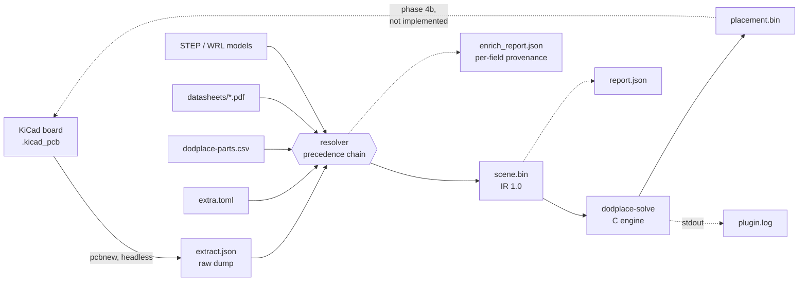
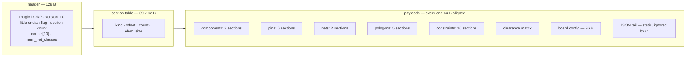
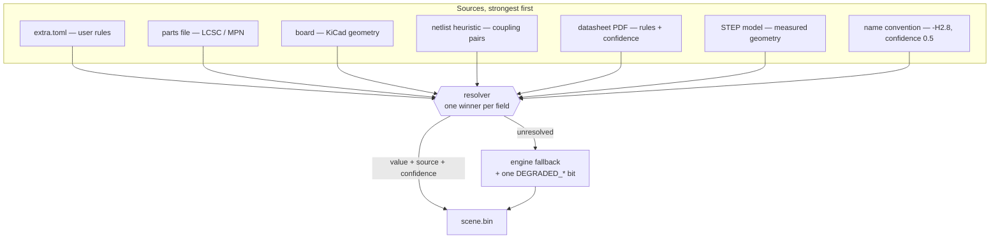
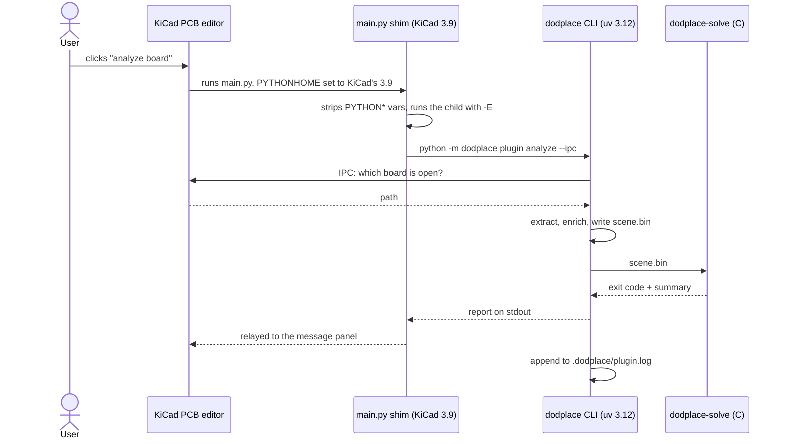

# dodplace — data map

Every byte the project writes: which file it lands in, who writes it, who reads
it, and what is deliberately left out.

Companion to [`../ir/spec.md`](../ir/spec.md), which is the normative format
specification for the two binary files.

> The diagrams below render inline in GitLab, GitHub, VS Code and CLion. Each
> one is also shipped as an SVG in `diagrams/`, so a plain viewer shows the
> picture too. The SVGs are renders of the Mermaid sources; regenerate them
> locally with
> `npx -y @mermaid-js/mermaid-cli -i <file>.mmd -o <file>.svg`.

---

## 1. Pipeline overview


<details>
<summary>Mermaid source</summary>



</details>

Solid arrows are implemented; the dotted arrow back into KiCad is the only
missing step (applying a placement).

---

## 2. Who writes what

| File | Written by | Read by | Real size on a 707-part board |
|---|---|---|---|
| `scene.bin` | Python: `ingest`, plugin action | **the C engine** | 144 KB |
| `placement.bin` | **C**: `dodplace-solve` | Python: plugin, tests | *(not produced yet)* |
| `extract.json` | Python: `extract`, plugin action | the resolver, humans | 1.2 MB |
| `enrich_report.json` | Python: resolver | humans, tooling | 193 KB |
| `report.json` | Python: plugin action | humans, CI | 1.4 KB |
| `plugin.log` | Python: plugin action | humans, `plugin log -f` | 7 KB |
| `extra.toml` | **you** (`enrich extra` seeds it) | the resolver | 3.6 KB |
| `dodplace-parts.csv` | **you** (`enrich skeleton` seeds it) | `enrich parts` | 1.3 KB |
| `cache/**/*.json` | `enrich parts`, resolver | the resolver | — |
| plugin files | `plugin install` | KiCad | 8 files |

All run artifacts land in `<board directory>/.dodplace/`. Nothing else is
written, anywhere, except the plugin directory and the repo pointer file.

---

## 3. `scene.bin` — the engine input


<details>
<summary>Mermaid source</summary>



</details>

### Components — 9 payload sections, `num_comps` elements each

| Section | Type | Field | Origin | Fallback |
|---|---|---|---|---|
| 1, 2 | f32 | `x`, `y` — courtyard centre, mm | footprint position | raw coordinates |
| 3, 4 | f32 | `half_w`, `half_h` — courtyard AABB | explicit AABB, or polygon AABB | pad bbox + margin |
| 5 | f32 | `height` — z extent, mm | STEP → PDF → parts file → `extra.toml` → name convention | 0, pure 2D |
| 6 | f32 | `mass` — grams | parts file / PDF | 0, no inertia |
| 7 | u8 | `flags` — orientation, side, locked, rot_fixed, poly courtyard, has height, has mass | KiCad + enrichment | 0°, top, unlocked |
| 41 | u8 | `kind` — role from the reference prefix: IC, capacitor, inductor, crystal, connector, mechanical... | refdes prefix (`U`, `C`, `L`, `Y`...) | unknown |
| 8 | u16 | `pin_count` | counted during ingestion | — |
| 9 | u32 | `polygon_id` — exact courtyard | footprint courtyard graphics | `0xFFFFFFFF` |

`first_pin` is **not** stored: it is the prefix sum of `pin_count`, rebuilt by
`placer_context_finalize`.

### Pins — 6 payload sections

| Section | Type | Field | Origin |
|---|---|---|---|
| 10, 11 | f32 | `offset_x`, `offset_y` — local, unrotated, mm | pad position in the footprint frame |
| 12 | u32 | `comp_id` — owner | pin grouping |
| 13 | u32 | `net_id` — net, or `0xFFFFFFFF` | netlist |
| 14 | u8 | `flags` — power, ground, diff P/N, clock, inferred | datasheet pinout, else net name |
| 15 | f32 | `max_current` — amps, 0 unknown | datasheet / parts file |

### Nets — 2 payload sections

| Section | Type | Field | Origin | Fallback |
|---|---|---|---|---|
| 16 | f32 | `weights` | net classes | uniform 1.0 |
| 17 | u8 | `net_class` — index into the matrix | KiCad netclass assignment | class 0 |

The CSR (`net_offsets`, `net_to_pins`) is **not** stored — it is rebuilt by a
counting sort over `pins.net_id`.

### Polygons — 5 payload sections

| Section | Type | Field |
|---|---|---|
| 18, 19 | f32 | `vx`, `vy` — all vertices, concatenated |
| 20 | u32 | `poly_offsets` — CSR over vertices, `num_polys + 1` entries |
| 21 | u8 | `poly_kind` — 0 courtyard, 1 board outline, 2 keepout |
| 22 | u32 | `poly_layer_mask` — keepout copper mask, 0 = all |

Rings are closed implicitly: the last vertex joins the first.

### Constraints — 16 payload sections (sparse tables)

| Sections | Type | Fields |
|---|---|---|
| 23-27 | u32, u32, u32, f32, f32 | decoupling: `ic_comp`, `cap_comp`, `ic_pin`, `max_dist_sq`, `weight` |
| 28-31 | u32, f32, f32, f32 | thermal: `comp`, `power_w`, `exclusion_radius`, `r_theta_ja` |
| 32-35 | u32, u32, u8, f32 | symmetry: `comp_a`, `comp_b`, `axis`, `weight` |
| 36-38 | u32, u32, f32 | diff pairs: `net_p`, `net_n`, `max_skew_mm` |

Rows must arrive grouped by their primary component (ascending); the engine
builds the per-component CSR index by counting. The `first_by_comp` arrays are
**not** stored.

### Rules — 1 payload section

| Section | Type | Field |
|---|---|---|
| 39 | f32 | `class_clearance` — symmetric N x N matrix, row-major, mm |
| 41 | u8 | `kind` — see the components table above; emitted with the components, numbered 41 to keep the series stable |

### Board config — one 96-byte section

| Field | Meaning | Default |
|---|---|---|
| `grid_origin_x`, `grid_origin_y` | placement grid origin | 0, 0 |
| `grid_fine`, `grid_coarse` | fine / coarse step, mm | 0.1, 0.5 |
| `courtyard_fallback_margin` | pad-bbox margin, mm | 0.25 |
| `global_clearance`, `courtyard_clearance`, `min_track_width` | design rules, mm | 0.2 |
| `total_thickness`, `ceiling_height` | mechanics; 0 = unknown | 0 |
| `airflow_x`, `airflow_y` | airflow direction; (0,0) = isotropic | 0, 0 |
| `allowed_sides`, `copper_layers`, `has_stackup` | stackup | both, 0, 0 |
| `allow_vias_under_body` | false = vias forbidden under courtyards | 1 |
| `disable_mask` | `OPT_DISABLE_*` features killed by the user | 0 |
| `degraded_mask` | the producer's 21 `DEGRADED_*` bits | — |

### JSON tail

A fixed string, `{"generator":"dodplace","ir":"1.0"}`, ignored by the C reader.
It exists so a file is self-describing and so the ignored-section path stays
exercised.

---

## 4. `placement.bin` — the engine output

Header: 32 B (`DODR`, version, flags, count, entry size). Then one 12-byte
record per component, **in component-index order**:

| Field | Type | Meaning |
|---|---|---|
| `x`, `y` | f32 | new courtyard centre |
| `orient` | u8 | 0..3 → 0 / 90 / 180 / 270 degrees |
| `side` | u8 | 0 = top, 1 = bottom |
| `flags` | u8 | bit 0 locked, bit 1 moved, bit 2 unplaced |

---

## 4b. Inside `dodplace-solve` — the stages

The engine reads a scene and writes a placement; it never mutates the scene.
Every stage allocates from the scratch arena, and a stage that fails sets `ok`
to false so the entry point unwinds cleanly. `--no-cluster`, `--no-global`,
`--no-refine`, `--no-legalize` disable one stage each, `--identity` skips the
solver entirely and echoes the input.

| Stage | File | What it does |
|---|---|---|
| 1 clustering | `solver_cluster.c` | reads `comps.kind`: an IC plus the inductor and capacitor on its switching node become one rigid body; the largest part is the master, the others keep a frozen offset and orientation *relative* to it |
| 2 matching | `matching_plan.c` | assigns decoupling capacitors to the IC pin each one decouples: a discrete assignment, so no rectangle moves and the DRC cannot change |
| 3 incumbent | `solver_best.c` | legalises the input as it arrived and keeps that pose as the incumbent: the pose every later stage has to beat on the engine's own cost |
| 4 global | `solver_global.c` | force-directed relaxation: every net pulls its pins to a star around their centroid, parts repel each other volumetrically, locked parts act as anchors |
| 5 refine | `solver_refine.c` | simulated annealing over swaps and rotations, then a deterministic rotation sweep; a rotation that would not fit the board is refused |
| 6 legalise | `solver_legal.c` | minimum-translation-vector push out of overlaps and keepouts, then spiral relocation for whatever still collides, clamped to the board |

Stage 3 is what stops a redraw of a board that did not need one, and stage 4
holds to the same rule: a relaxation that cannot beat the pose it started from
is rolled back before the discrete stages see it. Measured on r10, the
force-directed pass turned 31.7 m of wirelength into 41.5 m unclamped, lost the
comparison, and the annealer then improved the designer's own placement to
29.8 m — which is the point: the rule is "keep the better score", not "keep the
input" and not "keep the pipeline".

Cost is HPWL + crossing count + overlap count, weighted by `solver_options_t`.
Two uniform grids (parts, ratsnest segments) keep the pair work local; the
conflict grid registers up to `GRID_CONFLICT_MAX_PER_CELL` per cell because a
dense LED array is exactly where collisions hide.

**Reading the stats.** `overlaps in N true` is the input measured with the same
geometry the engine uses — in degraded mode the courtyard is the pad bounding
box, so an array of parts the designer placed side by side can already overlap
by that measure. `overlaps left N true (M involving a movable part)` is the
output; the `M` is the solver's own score, the rest is the designer's layout,
which the engine is not allowed to undo.

### Reference run (r10, 707 components)

| | |
|---|---|
| Configuration | the defaults: `--pad-clearance 0.50`, `--w-crossings 5.0`, `--polish-reach 0.20`, `--moves 4000` |
| HPWL | **29 818.9 mm** (input 31 699.6) — 1 881 mm better than the input and 6 993 mm better than the certified 36 812.2 mm baseline |
| Movable overlaps | **0** |
| KiCad DRC | **0 courtyards_overlap · 0 shorting_items · 0 solder_mask_bridge**, and 0 clearance, 0 hole_clearance, 0 copper_edge_clearance |
| Moves applied to the board | 194 of 707 footprints |
| Time | 0.85 s (release), of which 0.06 s is the incumbent and 0.30 s is the relaxation that is thrown away |

```sh
dodplace-solve r10.bin --solve --bench -o r10_placed.bin
uv run dodplace apply r10.kicad_pcb --scene r10.bin --placement r10_placed.bin \
    --extract .dodplace/extract.json -o r10_placed.kicad_pcb
kicad-cli pcb drc -o drc.txt r10_placed.kicad_pcb      # 0 / 0 / 0
```

**The 33 000 mm target is met with 3 181 mm to spare.** The levers are the
incumbent (stage 3) and the geometry corrections below: the earlier 36 812.2 mm
was not the cost of legality, it was the cost of redrawing a placement that was
already good, and of a copper model that read rotated footprints the wrong way
round, so the annealer could not be trusted with the moves that would have
helped. Three sweeps, kept as CSV
evidence in `docs/calibration/`, say the same thing from three directions:

| Sweep | Result |
|---|---|
| Annealing temperature (8 points) | **inert**: six of eight points give 36 812.2 mm exactly |
| `--moves` 4 000 / 8 000 / 16 000 × 3 seeds (54 runs) | **inert**: identical wirelength, spread 0.0 mm across seeds |
| `--pad-clearance` below 0.50 | breaks the DRC (9 rejections) and never gains wirelength |
| Anchoring the lanes | −2 900 mm, but +5 shorts and +9 mask bridges |

An inert knob is diagnostic: with the copper model reading the board wrong, the
annealer was exploring a landscape that did not match the one it was judging.
The last row is the same finding from the other end — pulling parts back towards
the designer's coordinates gains the wirelength, and the short and bridge
counters are what the copper model had to fix before the gain could be kept.

Three corrections were needed before any of it could be trusted:

* A drilled hole spans both sides. `PIN_NPTH` (bit 6 of `PIN_FLAGS`) marks a
  non-plated hole, and the side filter in `shape.c` treats it exactly as it
  treats copper on both faces. Without it a bottom-side SOT could be placed on
  top of the mounting hole H3, which KiCad reports as a mask bridge, a
  hole-clearance error and an edge-clearance error at once.

* KiCad turns a footprint the other way round. Measured against pcbnew, a pad
  at `(+2, 0)` moves to `(0, -2)` for a +90° footprint angle, while the engine's
  rotation tables were built for `R(+A)`. The scene's pin offsets are written in
  the frame of the angle a part *arrived* at, so the two agree until the solver
  turns a part, and then every pad-level test reasons about a footprint that is
  not on the board: 13 pads of the r10 run were predicted on the wrong side of
  their own footprint. The tables are now indexed by the pose KiCad draws
  (`solver_pose_orient`), which is invisible until a part actually turns.

* A stage that allocates must give the arena back. The pipeline legalises twice
  — the incumbent, then its own result — and the arena is never rewound
  mid-solve, so the second legalisation found no room, did nothing, and left the
  caller reading the first call's statistics on a layout it had not touched:
  46 courtyard overlaps in a run that reported zero. Each stage now starts from
  the same mark, and `placer_solve` refuses to write a placement when a stage
  failed.

---

## 5. `extract.json` — the raw board dump

| Level | Fields |
|---|---|
| root | `schema`, `backend`, `backend_version`, `warnings[]` |
| `board` | `path`, `copper_layers`, `outline[]` (point cycles) |
| `keepouts[]` | `name`, `layer_mask`, `xy[]` |
| `netclasses[]` | `name`, `clearance_mm`, `track_width_mm` |
| `nets[]` | `name`, `netclass` (effective class, resolved by KiCad) |
| `components[]` | `ref`, `value`, `fpid`, `x`, `y`, `rot_deg`, `side`, `locked`, `courtyard[]`, `models[]`, `fields{}`, `pads[]` |
| `pads[]` | `number`, `net`, `x`, `y` (**local, unrotated**), `size_x`, `size_y`, `attrib`, `drill` |

`fields{}` is free-form: it carries whatever the footprint declares, which is
where `LCSC Part` and `MPN` live — the join keys for the parts file.

---

## 6. `enrich_report.json` — per-field provenance

| Field | Content |
|---|---|
| `schema` | `dodplace.enrichment/1` |
| `components{ref}{field}` | `{value, source, confidence}` or `{"unresolved": true}` |
| `components{ref}.pin_role.<pad>` / `.pin_current.<pad>` | same shape, per pin |
| `unresolved{}` | field → number of components where nothing resolved |
| `sources{}` | source → number of values it supplied |
| `parts_matched`, `datasheets_read`, `datasheets_cached`, `step_models_read`, `names_read` | counters |
| `warnings[]` | non-fatal problems |

Tracked fields: `height_mm`, `mass_g`, `orientation_deg`, `power_w`,
`r_theta_ja`, plus the per-pin role and current.

Why the provenance model matters:


<details>
<summary>Mermaid source</summary>



</details>

Values are additive: each source fills what the previous ones left empty, and
whatever stays unresolved is left absent on purpose so exactly one
implementation of each fallback exists — the engine's.

---

## 7. `report.json` — the run summary

| Field | Content |
|---|---|
| `schema`, `board`, `found_via` | `dodplace.report/1`, path, `explicit` / `ipc` / `cwd` |
| `counts` | comps, pins, nets, net_entries, polygons, vertices, decoupling, thermal, symmetry, diffpairs |
| `coverage` | resolved / total per tracked field |
| `constraints` | constraint count per kind |
| `degraded_mask`, `degraded[]` | hex mask + readable names |
| `netclasses[]`, `derived_courtyards[]`, `diff_pairs[]` | detail |
| `warnings[]` | |
| `artifacts{}` | paths of `scene`, `extract`, `enrich_report`, `log` |

---

## 8. `plugin.log` — the action trace

Plain text, one block per invocation:

```
========================================================================
dodplace analyze  2026-09-22T23:54:12
board: /…/r9.kicad_pcb  (found via ipc)
  parts file: dodplace-parts.csv (14 record(s))
  707 components, 4143 pins, 604 nets (4126 connections)
  enrichment: 536 part(s), 0 datasheet(s), 0 cached, 696 STEP model(s)
  coverage: height 696/707, mass 0/707, orientation 0/707, …
  constraints: 40 decoupling
  degraded (0x000200BF): NO_3D_HEIGHT NO_MASS …
  unresolved: mass_g 707/707, orientation_deg 707/707, height_mm 11/707
  engine validation: ok (exit 0)
  artifacts: /…/.dodplace
```

It is the only artifact written in `--report-only` mode, because it is the
plugin's output channel.

---

## 9. Files you edit

### `extra.toml` — user rules

| Table | Content |
|---|---|
| `[board]` | `allowed_sides`, `ceiling_height_mm`, `airflow`, `via_under_body_allowed`, `courtyard_margin_mm` |
| `[board.net_clearance]` | net glob → mm; the net gets its own class |
| `[board.net_class]` | net glob → class name |
| `[board.class_clearance]` | class → mm, overrides the board |
| `[[component]]` | selectors `ref` / `fpid` (**globs**), plus `height_mm`, `mass_g`, `orientation_deg`, `rot_fixed`, `locked`, `side`, `power_w`, `r_theta_ja`, `exclusion_radius_mm`, `pin_roles`, `pin_currents`, `part_number` |
| `[[thermal]]` | `component`, `power_w`, `radius_mm`, `r_theta_ja` |
| `[[decoupling]]` | `ic`, `cap`, `pin`, `max_distance_mm`, `weight` |
| `[[symmetry]]` | `a`, `b`, `axis` (x / y / fixed), `weight` |
| `[[diffpair]]` | `p`, `n`, `max_skew_mm` |
| `[[keepout]]` | `layer_mask`, `polygon` |

Later blocks win field by field. Adding any `[[decoupling]]` row replaces the
netlist heuristic entirely.

### `dodplace-parts.csv` — supplier data

| Column | Filled by | Maps to |
|---|---|---|
| `LCSC Part #` | generated | store key `lcsc:C…` |
| `MPN` | generated when known | store key `mpn:…` |
| `Footprint` | generated | store key `fp:…` when no code |
| `Comment` | generated | `value` |
| `Designator` | generated | informational |
| `Height (mm)` | **you** | `height_mm` |
| `Mass (g)` | **you** | `mass_g` |
| `Power (W)` | **you** | `power_w`, becomes a thermal row |
| `Datasheet` | **you** | `datasheet_url` |

`#` lines are ignored anywhere in the file.

---

## 10. Enrichment cache — content-addressed JSON

```
<board>/.dodplace/cache/parts/<ab>/<sha256(key)>.json        key: lcsc:C25804 / mpn:… / fp:…
<board>/.dodplace/cache/datasheets/<ab>/<sha256(content)>.json
<board>/.dodplace/cache/steps/<ab>/<sha256(content)>.json
```

Record shape:

```jsonc
{
  "identity": "lcsc:C25804",
  "facts": { "height_mm": { "value": 0.45,
                            "provenance": {"source": "parts_file", "source_ref": "bom.csv",
                                           "confidence": 1.0, "fetched_at": "…"} } },
  "pin_roles":    { "1": { "value": "PIN_POWER", "provenance": {…} } },
  "pin_currents": { "1": { "value": 0.5,        "provenance": {…} } }
}
```

No PDF and no STEP file is ever copied in — only the facts read out of them.

---

## 11. Plugin install files


<details>
<summary>Mermaid source</summary>



</details>

| File | Content |
|---|---|
| `plugin.json` | `$schema`, `identifier`, `name`, `description`, `runtime{type, min_version}`, two actions with `scopes`, `icons-light/dark`, `args` |
| `main.py` | stdlib shim; absolute paths baked in (repo, venv python, uv, config, fallback log) |
| `requirements.txt` | comments only — KiCad marks a plugin ready only when `pip install -r` succeeds |
| `icons/*.png` | 8 files: 4 motifs x 24/48 px, light/dark |
| `~/.config/dodplace/repo` | one line: the checkout path, so the shim survives a move |

---

## 12. The join key

`scene.bin` is **anonymous**: no reference designators, no net names, no pin
names. Everything is an index.

```
extract.json  components[i]  ─┐
scene.bin     comps.*[i]     ─┼─ index i is the only link
placement.bin entries[i]     ─┘
enrich_report.json           ── keyed by refdes, the only place names live
```

So mapping a solver result back to a board object is a lookup by position in
`extract.json`'s component list. That is why the reports are keyed by reference:
they are the human-readable side of the same index.

---

## 13. Deliberately not exported

| Not stored | Why |
|---|---|
| net CSR, `first_pin`, `first_by_comp` | recomputed by `finalize()`, so the file cannot contradict memory |
| names (refdes, nets, pins) | the solver has no use for them, and they cost most of the bytes |
| per-pad-pair clearance | only the per-class matrix is needed |
| PDF / STEP contents | only the facts read out of them are kept |
| KiCad file writing | the board is never rewritten by us; phase 4b will use the IPC API |

---

## Regenerating everything

```sh
cd python
uv run dodplace ingest BOARD.kicad_pcb -o scene.bin         # + --report, --enrich-report
uv run dodplace show scene.bin                              # read any of them back
uv run dodplace enrich skeleton BOARD.kicad_pcb             # the parts CSV to fill
uv run dodplace enrich extra BOARD.kicad_pcb                # the rules starter
uv run dodplace plugin analyze --board BOARD.kicad_pcb      # the whole chain, read-only
./../build/gcc-debug/dodplace-solve scene.bin -o placement.bin
```
